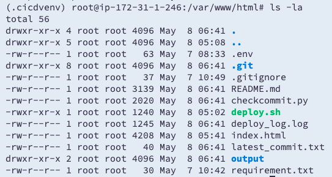
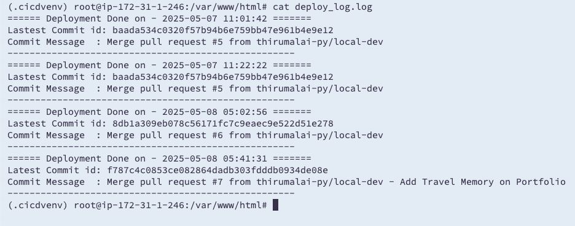

# CI/CD Pipeline Using Bash, Python, and Cron

This project provides a simple CI/CD automation pipeline for deploying a static HTML website to a Linux server (e.g., AWS EC2) using **Python**, **Bash**, and **Cron**. It checks for new commits on a specified GitHub branch and pulls + deploys changes automatically using `git` and `nginx`.

---
## 📁 Project Structure
```
├── index.html # Static HTML project (sample)
├── checkcommit.py # Python script to check for new commits via GitHub API
├── deploy.sh # Bash script to pull code and log deployment
├── .env # Stores repo info and credentials
├── latest_commit.txt # Tracks last deployed commit
├── deploy_log.log # Deployment logs
├── requirements.txt # Python dependencies
└── README.md # This file
```

---

## 🚀 Features

- GitHub commit tracking using the GitHub API
- Auto-pulls latest code and deploys using `git pull`
- Logs deployment commit ID, message, and timestamp
- Can be scheduled using `cron` every few minutes
- Uses `.env` for clean and secure configuration

## 🛠️ Setup Instructions

### 1. Clone This Repository

```bash
git clone https://github.com/YOUR_USERNAME/YOUR_REPO.git
cd YOUR_REPO
```

### 2. Install Required Packages

It's recommended to use a Python virtual environment:

```
python3 -m venv venv
source venv/bin/activate
pip install -r requirements.txt
```

⚠️ Never commit `.env` to GitHub. Add it to `.gitignore`.

### 3. Configure Nginx

Ensure Nginx is installed and create a basic config pointing to:

```
/var/www/html
```

### 4. Set Your GitHub Info Using `.env`

Store your GitHub credentials and repository details in a `.env` file in the project root:

```env
GIT_TOKEN=your_personal_access_token
BRANCH=main
GIT_REPO=thirumalai-py/ci-cd-basic
FOLDER_PATH=/var/www/html
```

### 5. Bash Deployment Script (deploy.sh)

The `deploy.sh` script:

- Loads .env
- Checks if there's a new commit using `git ls-remote`
- Runs `git pull` if a new commit is found
- Logs deployment info to `deploy_log.log`

Enable Excetable permission for `deploy.sh`   

```
chmod +x check_update.py deploy.sh
```
### 6. Python Script (checkcommit.py)

This script:

- Uses the GitHub API to compare the current deployed commit with the latest commit on the remote branch
- Triggers `deploy.sh` if a new commit is found

It reads all configuration from the .env file and can be scheduled via cron.

### 7. Schedule with Cron (Optional Automation)

To automate every 2 minutes, edit crontab:

Edit crontab:

```
crontab -e
```

Add the following to run the script every 2 minutes using virtualenv:

```
*/2 * * * * /bin/bash -c 'source /var/www/.cicdvenv/bin/activate && /var/www/.cicdvenv/bin/python3 /var/www/html/checkcommit.py >> /var/www/cron.log 2>&1'
```

## ✅ How to Test

1. Push a new commit to your GitHub repository.
2. Wait for 2 minutes.3
3. Check the deploy_log.log or open the deployed site in your browser.
4. You should see the changes live.


## Output Screenshots

**Folder Structure**



**Before Making Commit**



**After Making Commit**


